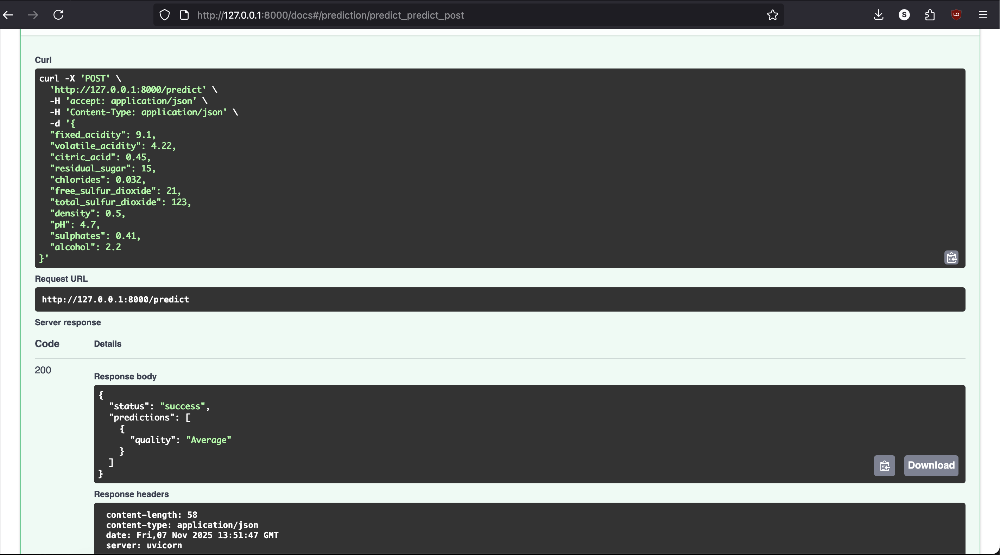

# Wine Quality Classification — Machine Learning Practical Exam

Author: Oluwaseyi Egunjobi

Overview
---
This repository contains a practical machine learning exercise that performs exploratory data analysis, preprocessing, model training, hyperparameter optimization, and model saving on the UCI White Wine Quality dataset. The main artifacts are a Jupyter notebook (`EDA_Notebook.ipynb`) that documents the entire workflow and `main.py` for any scriptable tasks.

What I did
---
- Loaded and inspected the white wine dataset from the UCI archive.
- Performed basic data cleaning (duplicate removal, type checks) and converted the numeric `quality` score into categorical labels (`Best`, `Good`, `Average`, `Bad`).
- Performed univariate EDA and correlation analysis with the target.
- Scaled features with `MinMaxScaler` and split the data into training and test sets.
- Trained several baseline classification models (Logistic Regression, Random Forest, Decision Tree, KNN, SVM, Naive Bayes) and compared their metrics.
- Performed hyperparameter optimization on the Random Forest using `RandomizedSearchCV` and re-evaluated the best estimator.
- Saved the best fitted model and scaler as `model.pkl` and `scaler.pkl` respectively (via `joblib`).

Files in this repo
---
- `EDA_Notebook.ipynb` — Jupyter notebook with the full analysis, plots, training, and evaluation steps.
- `main.py` — (Contains code for task 7 / API endpoint check; run if provided in the repo.)
- `model.pkl` — (Generated after running the notebook: the best Random Forest model.)
- `scaler.pkl` — (Generated after running the notebook: fitted MinMaxScaler.)
- `report.txt` — Short written report / commentary on results.

Recommended dependencies
---
The notebook uses common data science packages. To set up a virtual environment and install the main dependencies, run:

```bash
python3 -m venv venv
source venv/bin/activate
python -m pip install --upgrade pip
python -m pip install numpy pandas matplotlib seaborn scikit-learn joblib jupyter
```

Note: If you prefer, create a `requirements.txt` with pinned versions and install from it.

How to run
---
1. Activate your Python environment (see above).
2. Launch Jupyter and open the notebook:

```bash
jupyter notebook EDA_Notebook.ipynb
```

3. Run the notebook cells in order. The notebook will download the dataset zip, extract the white wine file, perform analysis and training, and will save `model.pkl` and `scaler.pkl` to the working directory.

Optional: If `main.py` exposes a prediction API or script, you can run it with:

```bash
python main.py
```

(See `main.py` for exact usage or any CLI flags.)

Prediction API (example)
---
The project exposes a prediction endpoint (example shown in the project Swagger/docs). Below is an example curl request and the sample response as captured in the screenshot you provided.

Request URL

```
http://127.0.0.1:8000/predict
```

Example curl request

```bash
curl -X 'POST' \
	'http://127.0.0.1:8000/predict' \
	-H 'accept: application/json' \
	-H 'Content-Type: application/json' \
	-d '{
	"fixed_acidity": 9.1,
	"volatile_acidity": 4.22,
	"citric_acid": 0.45,
	"residual_sugar": 15,
	"chlorides": 0.032,
	"free_sulfur_dioxide": 21,
	"total_sulfur_dioxide": 123,
	"density": 0.5,
	"pH": 4.7,
	"sulphates": 0.41,
	"alcohol": 2.2
}'
```

Sample successful response (HTTP 200)

```json
{
	"status": "success",
	"predictions": [
		{
			"quality": "Average"
		}
	]
}
```

```markdown

```

Contact
---
Oluwaseyi Egunjobi

License
---
This repository is provided for educational purposes. No license specified.
